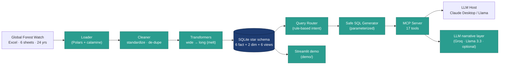

# 🌳 MCP-Forest — Forest Climate Analyzer

> A Model Context Protocol (MCP) server that turns 24 years of Global Forest Watch data — deforestation, primary-forest loss, and forest-carbon emissions for **165 countries** and **2,779 subnational regions** — into natural-language answers, with a live interactive demo.


-000000)


**🔗 Live demo:** _<paste your Streamlit / Hugging Face Space URL here>_

<!-- Add a screenshot/GIF:  -->

---

## What it does

Ask plain-English questions about global forest loss and get grounded, data-backed answers:

> *"How much primary forest did Brazil lose in 2023, and which states were worst?"*
> *"Rank the top carbon-emitting regions in Indonesia."*

A deterministic MCP server exposes **17 query tools** to any MCP-capable host (Claude Desktop, or a local/hosted open-source LLM). Routing and SQL are rule-based and **parameterized** — no hallucinated SQL, no injection — and an optional LLM layer turns results into an executive-readable narrative. The **`demo/`** folder is a Streamlit app that runs the same analytics layer over real data so anyone can explore it in a browser.

---

## Architecture



Excel → Polars ETL (wide-to-long melt) → SQLite **star schema** (separate fact tables avoid a sparse 8-threshold matrix). A router classifies intent and a safe generator emits parameterized SQL; the MCP server exposes country- and region-level tools. The narrative layer is a provider-agnostic, OpenAI-compatible client (default **Groq + Llama 3.3 70B**, free; local **Ollama** supported) that **fails soft**, so structured data is always returned even with no LLM.

---

## Key numbers

| | |
|---|---|
| Countries | **165** |
| Subnational regions | **2,779** |
| Years | **2001–2024** |
| Fact rows (full build) | **~800,000** |
| Tables | 6 fact + 2 dim + 6 views |
| MCP tools | **17** (country + subnational) |
| Full ETL rebuild | **~7 seconds** (Polars + calamine) |
| Tests | **41 passing** |

---

## Tech stack

**Python · Polars · SQLite · Model Context Protocol (MCP) · FastExcel/calamine · Streamlit · Llama 3.3 (Groq) / Ollama · Docker · pytest**

---

## Run the demo locally

```bash
git clone https://github.com/Rushikesh-S-Ware/MCP-Forest.git
cd MCP-Forest/demo
pip install -r requirements.txt
streamlit run app.py
```

Optional AI narratives: add a free [Groq](https://console.groq.com) key as `LLM_API_KEY`
(in `.streamlit/secrets.toml` or an env var). Without it, all charts and metrics still work.

## Run the full MCP server

The server runs in Docker and connects to an MCP host (e.g. Claude Desktop). See the
in-repo guides for the build/run steps; the analysis LLM is configured via
`LLM_BASE_URL` / `LLM_MODEL` / `LLM_API_KEY` (Groq by default, Ollama for fully local).

---

## Data model

Star schema — separate fact tables per metric (country + subnational), keyed by
`country [+ subnational1] + year + threshold`:

- `fact_tree_cover_loss` / `fact_subnational_tree_cover_loss` — tree cover loss (ha), 8 canopy thresholds
- `fact_primary_forest` / `fact_subnational_primary_forest` — primary-forest loss (tropical, 30%)
- `fact_carbon` / `fact_subnational_carbon` — gross forest-carbon emissions (Mg CO₂e, 30/50/75)
- `dim_location`, `dim_time` + 6 analytical views

---

## Attribution

The Nexus-MCP system was a **team graduate capstone** (GMU DAEN 2025, Team Nexus —
[source repo](https://github.com/newsconsole/GMU_DAEN_2025_02_A)). **My contributions:**
the Polars ETL and star-schema transforms, the MCP query/routing layer, the **subnational
data tier** (3 added fact tables + matching tools), and migration of the analysis LLM to a
**free, provider-agnostic open-source model** (Llama via Groq/Ollama). The `demo/` app is my own.

## Data source

Hansen / UMD / Google / USGS / NASA — [Global Forest Watch](https://www.globalforestwatch.org/)
(tree cover & primary forest); GFW forest-carbon flux model. Accessed 2025.

## License

[MIT](LICENSE)
